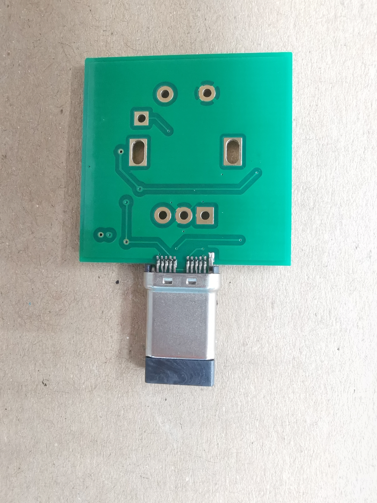

# roPlug
ATMega32U4 with a male USB plug.

***

- [KiCAD Pictures](#KiCAD-Pictures)
- [PCB Pictures](#PCB-Pictures)

Extra parts - post pcba:

- EC05E1220203 - 2.7mm low profile encoder | [mouser](https://www.mouser.com/ProductDetail/Alps-Alpine/EC05E1220203?qs=%2Fha2pyFadujxX3lsKV%2F2v0IdfHtW%2FTX9iJN7eVGbwjXvhMXGXqwokw%3D%3D) | [SnapEDA](https://www.snapeda.com/parts/EC05E1220203/ALPS/view-part/157580/?ref=search&t=EC05E1220203) | [datasheet](https://www.mouser.com/datasheet/2/15/EC05E-1370804.pdf)
- EC12E1220301 - 4.5mm encoder | [mouser](https://www.mouser.com/ProductDetail/688-EC12E1220301) | [datasheet](https://www.mouser.de/datasheet/2/15/EC12E-1370769.pdf)

***

## KiCAD Pictures

***

## PCB Pictures

Note: The Molex USB C connector reaches a bit past the solder masks, but
shouldn't affect the assembly process. (Fig. 1)

*Fig. 1*  

